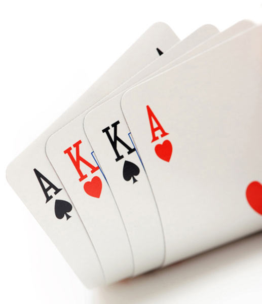

# PokerRL Omaha

A fork of the original [Framework for Multi-Agent Deep Reinforcement Learning in Poker games](https://github.com/EricSteinberger/PokerRL) by [Eric Steinberger](https://github.com/EricSteinberger)
Combined with [SD-CFR](https://github.com/EricSteinberger/Deep-CFR) and Deep CFR.

Had Texas Hold'em Poker before, Now works with Omaha Poker, unattempted before publically. 

The Internet lacks any open-source Omaha Poker Reinforcement Learning code, so I created this part myself.
While Omaha is orders of magnitude bigger than toy/constrained games used with SD-CFR before, noticeable upgrades have been made into distributed computing scheme
to achieve convergency and significantly decrease wall time.

## Changes
Only differences are noticed here, compilation and basic usage are exhaustively explained in the original repos.
Some new dependencies exist, full dep. list is in requirements_dist.txt.

Used Pycharm+venv for development, so with Conda or other managers you might have to move start scripts to the root
folder if encounter any problems with missing internal modules.

#### Fully functional Pot Limit Omaha game:

 - Works for 2-6 players.
 - Smoothly integrated into the code, so the functionality of the original PokerRL is preserved.
 - All the lookup tables are rewritten in pure Python, generation of most of them is fully vectorized, so takes less than 10 secs to build on the start.
 - Uses the original hand evaluator with Omaha combinations on top. Being naive and slow, it slightly impacts the speed of LBR rollouts. 

Use game type 'PLO' to start, an example is provided in 'examples/PLO_training_start.py'.

#### GPU-CPU combined distributed scheme

 - 1 GPU worker for Advantage Nets Training
 - N CPU workers for sample generation
 - approx. 2 to 3 times cycle wall time decrease
 
 #### Different Network Scheme

 - 4 Deep networks instead of one, trained independently *in progress

#### Preflop Hand Bucketing 
 - Works for Hold'em and Omaha.
 - Improves Neural Network convergence at the beginning of the training, thus decreases overall convergence time.
 - Buckets together all preflop-isomorphic hands, e.g. AsKh and AdKc - suits don't matter without a flop.
 - Uses additional bucketed lookup table with empty suit bits. 
 - Found in neural network modules FLAT, FLAT2 and CNN.
 
 Could be named a handcrafted feature which slightly conflicts
  with a general self-play education idea, but PokerRL actually buckets isomorphic flop cards, and everyone does it as well.
  
#### Optimized Dense Residual Neural Network 
 - MainPokerModuleFLAT2 which is used by setting nn_type='dense_residual'.
 - NN which is 2x deeper but has roughly the same
 computational complexity as the original FLAT.
 - Yields around 11% faster training in terms of loss decrease.
 - Significantly outperforms the original NN agent in PLO on any training step tested in h2h.
 
#### Convolutional Neural Network 
 - Which hasn't explored much and doesn't work well ATM. The idea is to
  explore network potency to pick all the parameters without human segmentation from a 2D array. First 2-4 rows are private cards,
  next 5 are board cards and the last one is a vector of stacks and bets happened before.
  Total array size is 8X24.
 
#### Leaky ReLU usage for all NNs
 - The negative slope of 0.1 is tested to improve loss decrease speed by 2-6% at no cost.
 
#### Standalone Head to Head Agent evaluator
 - Standalone module written with takeaways from the original h2h evaluator of PokerRL.
 - Is handy to evaluate different agents against each other.
 Can be found in 'examples/interactive_agent_vs_agent.py', a short parameter description is inside.
 Class AgentTournament is extended to hold the functionality.

#### Standalone LBR Agent evaluator
 - Standalone module written with takeaways from the original h2h evaluator of PokerRL.
 - Is handy to evaluate an agent with LBR method.
 Can be found in 'examples/eval_agent_lbr.py', a short parameter description is inside.
 
#### Hand Logger for H2H Evaluator
 - Writes actual hands played in close-to-PokerStars format in .txt file.
 - Enabled by default in Standalone H2H Evaluator.
 - Modifies classes PokerEnv and AgentTournament and to catch all the activity.
 - Introduces HandHistoryLogger class.
 Allows manual hand history reading and storing in a plain text, could also be
  loaded in PT4 for basic analysis, although not fully mimics the correct
  HH format - the only goal was to make played games easy readable.
  
#### Improved Traversal Data generation scheme
 - Rather generating full amount and skipping some to enter buffer, a вусдшту in generated amount is used - times faster on late steps.
 - now n_traversals_per_iter sets the exact number of data entries created for each player
 (was a number of external traverser rollouts before, which has been producing quite unstable amounts)
 
#### Bug fixes
 - I don't remember them all, but among most important are the use of deprecated torch tensor classes
 which crashed the GPU code on recent torch versions, some index miscalculations and wrong unsqueezes.
  
  
